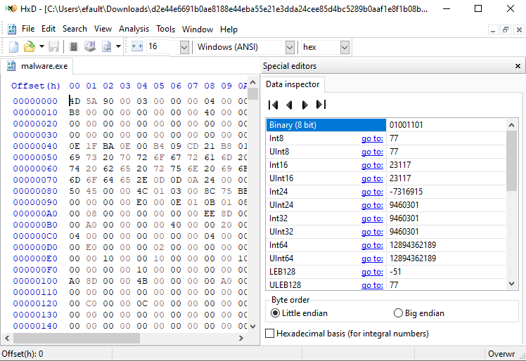

## Introduction
<blockquote style="color: #ff5733;">

 Darkness lurks in every line, waiting to unleash its sinister design

</blockquote>
Hi there, this blog post is about a basic Analysis on Malware. Its a very short blog where we will conduct the static Analysis on Malware. 
Random malware has been downloaded on the windows VM. Apologies for the short blog post but still I am learning things and will soon post the
detail writeup on it including how you can create a home lab setup for Malware Analysis. But before moving on let me show you that
### Prologue
The *prologue* is about getting hashes of the malware whether `md5` or `sha256`. 
We will see how one can generate the hash which is important for further analysis in Virus Total. There are many ways for the hash generation but the ways that I know are as given 
below.
#### Certutil
    There is a utility for windows which is used to display and dump the CA configuration information. We won’t talk about CA info here but it’s a 
popular utility which is being abused by the black hats to download or Deobfuscate the malicious files. You can generate hashes too by using this 
utility as shown in the below figure.
.PNG)
Above image is all about generating `SHA256` hash for the file that we are analyzing. The same utility can be used to generate the `MD5` hash too as shown  
in below image.
.PNG)
#### Winmd5
Now there is another program a bit old but the goated one in generating the MD5 hashes only. Refer to the below image. Note that this program is only availaible for windows only :).

<blockquote style="color: #ff5733;">
If you have successfully generated those hashes of the malware file just put it in Virus total, so you can get the better idea about how severe the speicifed malware is.
At the time of Analysing that malware I just closed my machine so was unable to put it into the virustotal so again apologies for it :').
</blockquote>
If you want to downlaod the sample of malware there are many sources out there even people have created the github repositories for it. At the time of writing this article I downloaded the sample from 
[Malware Bazar](https://bazaar.abuse.ch/). Go check out different Malwares :)

### Seeking Light in Darkness
For analysis I already downloaded the sample from the specified website that was referenced above. Beleive me I don't even know what the file is about so I just renamed it to `malware.exe`. Refer to the below image.

From the bird’s eye view we know that it is Portable Executable (PE) file. Before moving on to the magic header here is the basic structure of 
`_IMAGE_DOS_HEADER` shown below.
```cpp
typedef struct _IMAGE_DOS_HEADER
{
     WORD e_magic;
     WORD e_cblp;
     WORD e_cp;
     WORD e_crlc;
     WORD e_cparhdr;
     WORD e_minalloc;
     WORD e_maxalloc;
     WORD e_ss;
     WORD e_sp;
     WORD e_csum;
     WORD e_ip;
     WORD e_cs;
     WORD e_lfarlc;
     WORD e_ovno;
     WORD e_res[4];
     WORD e_oemid;
     WORD e_oeminfo;
     WORD e_res2[10];
     LONG e_lfanew;
} IMAGE_DOS_HEADER, *PIMAGE_DOS_HEADER;
```
The above structure is the definition for `_IMAGE_DOS_HEADER` which consists of 
several fields. We will not explain every field but for now the only 
concerning field for us is `WORD e_magic`. Which tells about the magic number 
of the file that we are currently working on. Magic number is basically the 
identification number for a file. To analyze the magic number of the 
executable we will use the program call `Hxd` or known as the hex-editor. Just 
load the binary into Hxd and observe the Magic number.  

As shown in the first entity `0x00000000` we have `4D 5A` or `0x5A4D` and is the 
hexadecimal representation of ASCII characters `MZ`, which is by default clear 
that it is a Portable Executable File. The other entity is `LONG e_lfnew` which 
contains the offset to the `NT headers`. They contain a lot of information 
which is related to the PE file.
### The Footprints
The next step is to look for string inside the executable. So again, there 
are many ways for it. 
#### Strings
Now time for the first utility which is strings that is already present in 
Sys-Internal suite if I am not forgetting. I have just redirected the output 
to the file.

It depends on you whether you are redirecting the output to the seperate file or want to see the exact output from the command line
#### Floss
Floss is the utility that is based on python and its absolutely amazing one. 
Reference to the below image.

The output from the floss was
.PNG)
#### Radare2
Now here comes the goated one Radare2!. Radare2 is one of the most powerful debuggers and reversing tools out there. So here we used radare2 to extract out the strings using (iz) as shown in 
below image.
.PNG)
<blockquote style="color: #ff5733;">
Note: 
 “As you can see in the screenshot the `.rsrc` is the section in PE file 
which contains resources used by the application such as icons, images, menus 
and especially strings.” 
Here we got our strings from `.rsrc` section as shown in the above snippet. 
</blockquote>
#### Seeked the light
There was some sort of additional step. We loaded the binary in radare2 use `aaa` command to analyze the binary from start to end. Now we used `ii`
command to look up for the import functions. Let me tell you that Imported functions are those functions, that are imported from the external 
libraries meaning they are not used here in the program but called externally. In the below screenshot radare2 is showing the imported function and same 
thing was seen in IDA both debuggers/disassemblers showed the imported function which is `mscoree.dll`. 
According to the community online which states that. 
<blockquote style="color: #ff5733;">
“If the import table includes `mscoree.dll` and include the entry for the 
function `_CoreExeMain` then definitely the exe is `.NET` compiled” 
</blockquote>
And same thing is happening in the below image. 

I am not explaining the why and what’s of these imports for several reason so for now just remember the binary is .NET compiled.
So, If you want to analyze the `.NET` or `C#` binaries, there are many cool tools out there but I would suggest just go for `DNSPY`, one of the beautiful tools out 
there you can just download it from there official Git-hub repo. Refer to the below image. 

We loaded the binary into it and see what we got, A more formattable way to analyze the stuff. Many headers are used here but we will not explain here. 
So, stopping the static analysis here because still there is stuff related to .NET that I didn’t cover. But soon I will cover the stuff in more detail including the APIS stuff.
Soon I will include further things when they are necessary. 
fuzz testing involves this step
[fuzzing](https://excalidraw.com/#json=WR73f8A5Q81VytrLglzmo,r0lhPl63yVURwj1Np-rJHw)